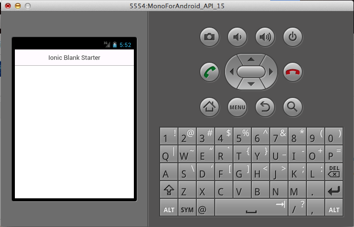

# Getting started with Ionic (AngularJS for mobile & Cordova)

Ionic is an HTML5 mobile app development framework targeted at building hybrid mobile apps. Hybrid apps are essentially small websites running in a browser shell in an app that have access to the native platform layer. Hybrid apps have many benefits over pure native apps, specifically in terms of platform support, speed of development, and access to 3rd party code. For more information check the [official website](http://ionicframework.com):

OK! Let's get started! Firstly we need to install Cordova. In order to do that we need to install NodeJS, so if you haven't done this already do it and come back here. 

Cordova will enables us to package our app with a native wrapper. It also provides access to the device's resources like the GPS,Accelerometer and so on. Ok let's proceed with the installation:

	sudo npm install -g cordova

Then we need to install the Ionic CLI tool that we will be using to manage our apps:

	sudo npm install -g ionic
	
Great! Now that we have everything we need let's create the stubs for our project:

	ionic start MyApp blank

Some Basic directions will appear, have a look at them they will come in handy...

I assume that you will be running your app on an Android device if this is not the case enable the corresponding platform:

	cd MyApp
	ionic platform android
	
At this point if an error messages appears saying the following:

>Error: ANDROID_HOME is not set and "android" command not in your PATH. You must fulfill at least one of these conditions.

You'll have to download the [Android SDK](https://developer.android.com/sdk/index.html?hl=i) and set up the PATH variables.

The path of the Android SDK on my machine was:

	/Users/kzarifis/android-sdks
	
so I will open up my bash_profile file and add the appropriate directories:

	vim ~/.bash_profile
	
and the line I will be adding is the following:

	export PATH=$PATH:/Users/kzarifis/android-sdks/tools:/Users/kzarifis/android-sdks/platform-tools 
	
Then exit vim (or whatever editor you prefer), source the bash profile and try to enable the Android platform again:
	
	source ~/.bash_profile
	ionic platform android

Again, if that doesn't work troubleshoot the problem and try to enable the platform you want...

I will be using the standard Android emulator to run the app but there are better and faster ones available (like Genymotion, Manymo and so on) so maybe you should have a look at them especially if your computer is rather slow. 

OK, let's now run the sample app:

	ionic build android

An error might pop up again saying that ant is not available. try the following:
	
	ant -version

If there is not such module we need to install it first. In MacOS do the following:

	brew update
	brew install ant
	
Brew will now download ant and try to link it

>Error: The `brew link` step did not complete successfully

>The formula built, but is not symlinked into /usr/local

>Could not symlink bin/ant

>/usr/local/bin is not writable.

>You can try again using:

>  brew link ant

I tried to run brew link ant but it wasn't working so, I just added the directory to the path:

	vim ~/.bash_profile
	
Add the path where ant is installed e.g:
	
	export PATH=$PATH:/usr/local/Cellar/ant/1.9.4/bin/
	
Source bash again and try out ant:

	 source ~/.bash_profile
	 ant -version
	 
The output I got was:

>Apache Ant(TM) version 1.9.4 compiled on April 29 2014
	 
Great it works let's try to build our app for the Android platform again:

	ionic build android

If that works then run the following:

	ionic emulate android
	
	
Yay! It's live!

