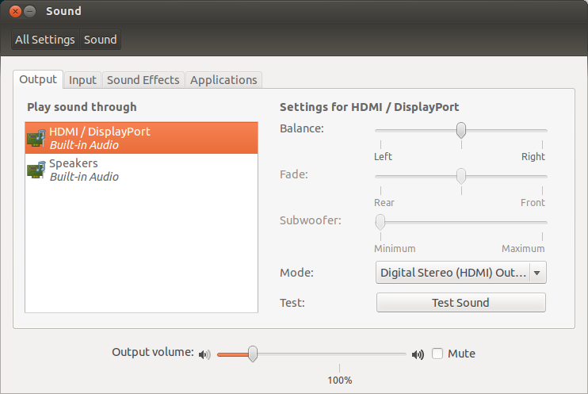

# Linux - No sound over HDMI/mini Displayport 

So since I spend a lot of time working on my ultrabook and since working on a 13" screen is kind of a pain, I decided to buy a monitor to make my life easier. My laptop has an Intel HD Graphics 4000 and (like every laptop that respects itself) it also provides a MiniDisplay Port. The afore-mentioned monitor has build in speakers and an HDMI (among others) port that could be used to drive the audio to the speakers.

Like every logican human being I got a mini-DisplayPort to HDMI cable to connect the two. When I plugged it in though I noticed that I couldn't use the speakers of a monitor at all. The only output that my OS was seeing were the built in speakers of my laptop. After Googling around I run the following:

	speaker-test -c 2 -r 48000 -D hw:0,3
    
YES! Let there be sound! 

After running this command I was hearing some sound from my monitor's speakers. Cool press Ctrl+C and checkout the audio outputs.

Perfect... Select the HDMI / DisplayPort and you're done!