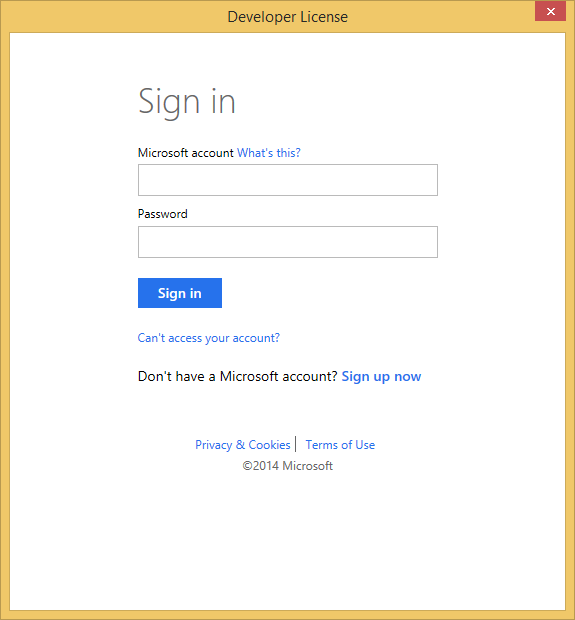

# Getting started with windows phone development

Firstly we need to set up our development environment. For that we wll be using the official Windows Phone SDK and the Microsoft Visual Studio express IDE. We should mention that Windows Phone SDK 8.0 requires 64-bit Windows 8 Pro or higher. You can't use any Windows 7 or Windows Server version to implement your apps (more info [here](http://msdn.microsoft.com/en-us/library/windows/apps/ff626524.aspx))

Click [here](http://dev.windows.com/en-us/develop/download-phone-sdk) to go to the corresponding website and download the required tools.

We will be developing an app for windows phone 8.1 so we need to [get Visual Studio Express 2013 for Windows](http://www.visualstudio.com/en-us/downloads#d-express-windows-8), on that page click on the "install now" link for Microsoft Visual Studio. You need to have a hotmail/outlook account so if you don't have one (and trust me no one will blame you if you don't) create one and log in. A basic form will show up, fill in the fields and click on express 2013 for Windows.

At this point an installer is gonna get downloaded, when this is done launch it.

On the window that pops up you can select where to install Visual Studio and click next.

A new webpage should open up in your browser, fill up the project name and create the new project.

Next you're going to see that your new project is ready. Click on Visual Studio to launch it. When you do that visual studio will pop up and it's going to ask you for your credentials you used before. After entering them microsoft is going to link your Visual Studio instance to your account.

A new message will pop up that will prompt you to get your developer license. Again enter your credentials and sign in.

If everything goes as planned a popup will let you know that you got the developer license and it will also mention the expiration date.

If you plan to create an app that is intended to run on mobile devices you have to download the corresponding emulators.

so go back [here](http://dev.windows.com/en-us/develop/download-phone-sdk) and download the emulators for windows phone 8.1. You will need to shut down Visual Studio in order to install the emulators.

Great, let's now create a simple project.

Click on New Project.

select the Visual C# option and click on the option "blank app"

http://channel9.msdn.com/Series/Windows-Phone-8-Development-for-Absolute-Beginners/Part-3-Writing-your-First-Windows-Phone-8-App

http://blogs.technet.com/b/canitpro/archive/2014/03/11/step-by-step-enabling-hyper-v-for-use-on-windows-8-1.aspx